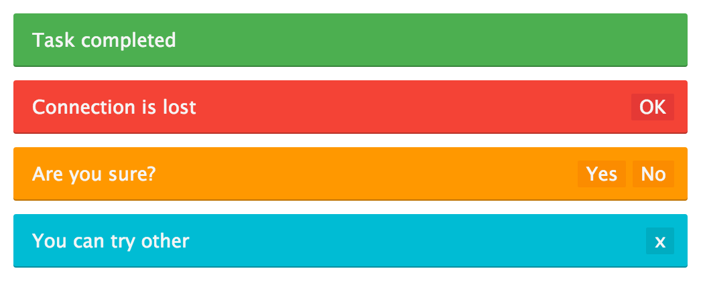

# messg

> Messages via CSS3 animations



## Install

```sh
npm install --save messg
```

## Usage

```js
import messg from 'messg';

messg
  .success('Awesome!')
  .button('Ok');
```

## API

### messg(text[, type, delay])

Create `Message` instance.

#### text

Type: `string`

Message text.

#### type

Type: `string`  
Default: `'default'`

Message type:

* default
* success
* info
* warning
* error

#### delay

Type: `number`  
Default: `null`

Аutohide timeout.

### messg.default(text[, delay])
### messg.success(text[, delay])
### messg.info(text[, delay])
### messg.warning(text[, delay])
### messg.error(text[, delay])

Aliases for `messg(text[, type, delay])`

```js
messg.warning('Connection is lost');
messg.success('Task completed', 2500);
```

### .button(name[, fn])

Add button.

#### name

Type: `string`

Button title.

#### fn

Type: `function`

Handler for click on the button.

Buttons with handler:

```js
messg
  .warning('Are you sure?')
  .button('Yes', () => {

  })
  .button('No', () => {

  });
```

Simple close button:

```js
messg
  .success('Task completed')
  .button('Ok');
```

If buttons not specified, close message by clicking on it.

### .hide(fn)

Add hide handler.

#### fn

Type: `function`

Handler for hide the message.

```js
messg
  .warning('Hello!')
  .hide(() => {

  });
```

### messg.clean()

Close all messages in flow.

## Options

* `messg.speed` — show and hide speed (ms), default `250`
* `messg.position` — messages position `top` or `bottom`, default `top`
* `messg.flow` — disable messages flow if `false`
* `messg.max` — max flow length, default `false`

## License

MIT
